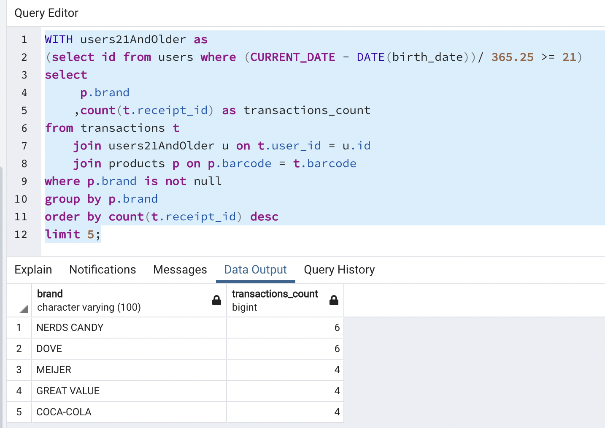
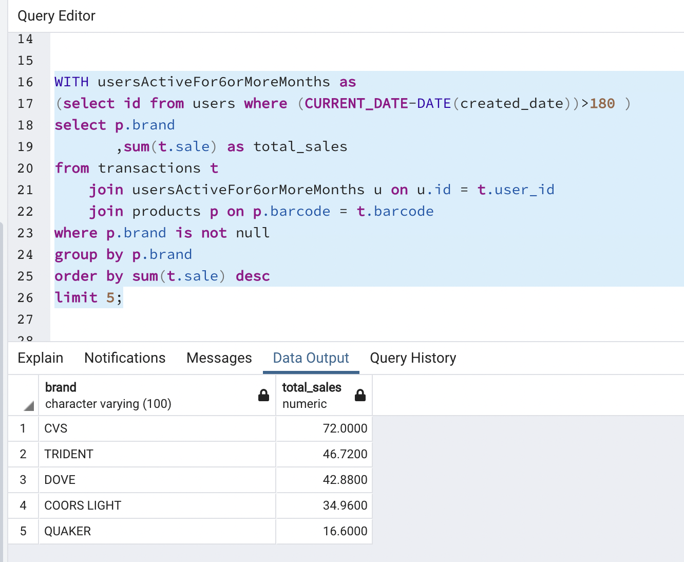
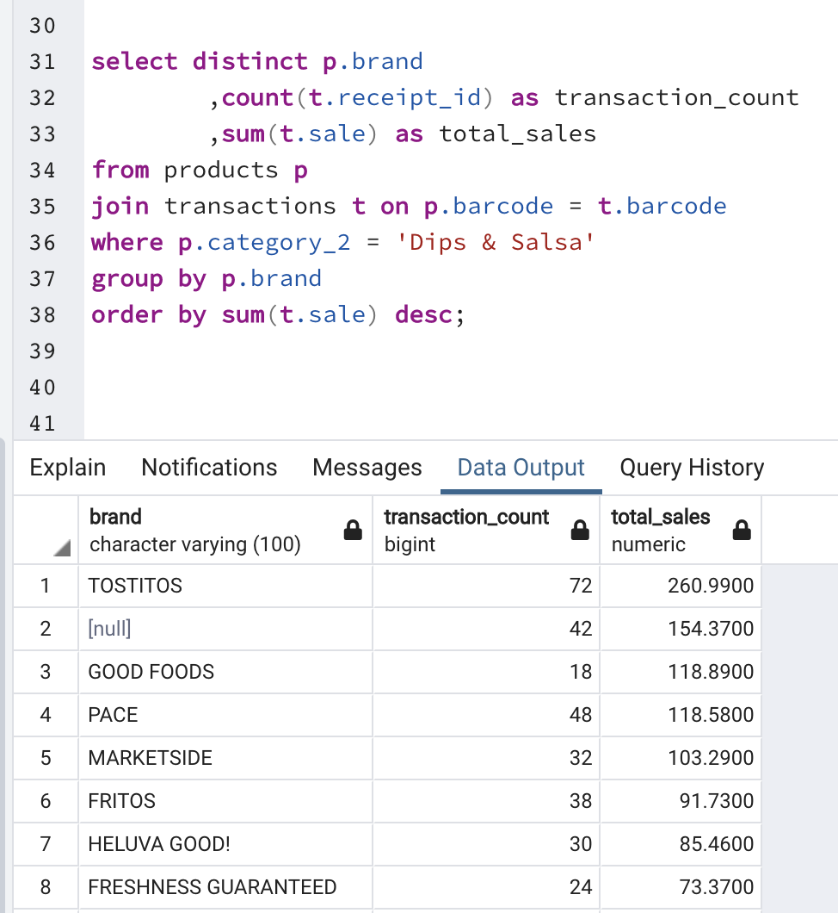
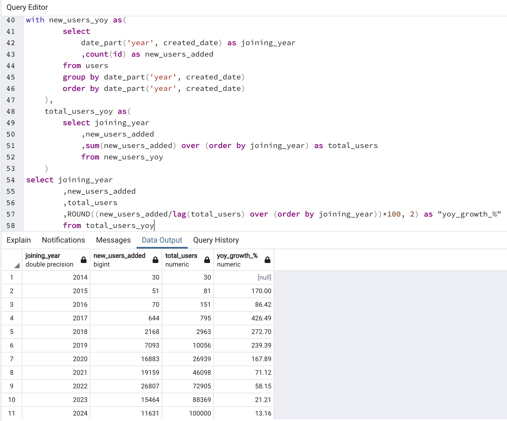
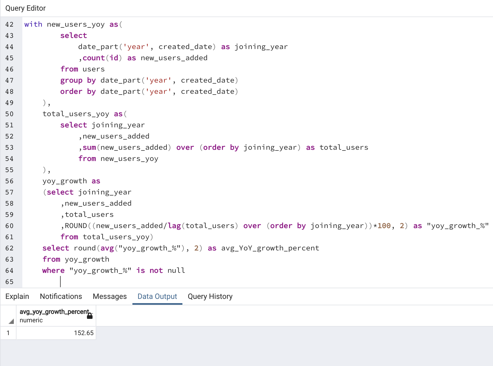

# Fetch Take Home Challenge Solution

Below are my answers for all the take-home assignment questions. I came up with this answers using the code provided above for individual section. If need more clarity please refer the respective files.

## 1. Explore the data

### 1.1 Any data quality issues?
Yes there are some data quality issues in each part of data. They are as follows:

#### 1.1.1. Users Data
1) Female were almost more than double than males in users gender. If this is not a complete data, need to have a better sampling if possible.
2. Very few users vere >80 or <10 years old. So that is a good thing that age is folling a normal distribution.

#### 1.1.2. Products Data
1. Almost 25% of the Manufacturer and Brand are null values.
2. Duplicates present for Barcode column. Not a good thing to create one to many relationship with Transactions data

#### 1.1.3. Transactions Data
1. Final_quantity data type is not consistent. Should have all numeric values but some alphabetical values preset like 'zero'.
2. Final_sale have similar type of issue, contains ' ' values instead of 0.

### 1.2. Fields challenging to understand?

Not much, all were pretty clear. Just small confusion about sale whether the sale value represent the price on the bill the user has scanned or the sale amount Fetch made behind each transaction.

## 2. SQL Queries

I have provided complete solution and answers in the file SQL questions. I'm using Postgres SQL.

### 2.1. Close-ended questions:

1. Top 5 brands by receipts scanned among users 21 and over?

2. Top 5 brands by sales among users that have had their account for atleast 6 months?

### 2.2. Open-ended questions

#### 2.2.1. Leading brand in the Dips and Salsa category?

I’m defining a leading brand as the brand which has a higher number of transactions and higher sales as well. I tried to find if there is a brand with less number of transactions but higher sales and there was not. In both cases there is one clear winner that is ‘Tostitos’.

#### 2.2.2 What percent Fetch grown year over year?

There is very limited data available to find the year over year growth for Fetch. For this question, I’ll be only looking at the number of customers Fetch has gained year over year. I’m using the users table and assuming all these users are active users, since there is no current way to figure out the exact active users since the transactions table also only has 3 months of data.

First I’m finding the new years in each year and also the total users using the cumulative sum. The formula I’m using to find YoY growth is: \
(this_year_new_users_count / last_year_total_users_count)* 100.

The next step is simple to calculate the average YoY growth, the output as follows. Based on assumptions I made and looking at only the new customer base acquired each year, it is safe to say Fetch grew 152.65% YoY over the last 10 years.

## 3. Email

Below is the sample email I would draft to convey the points I understood during analysis.

Hi John,

Hope you're doing well.

I just finished analyzing the data I received for products-users-transactions and wanted to briefly share some insights with you.

The majority of data looks fine, there are some issues but not something I can not do a work around for. Only couple of things I'd say is that the transaction data is just for 3 months from June-September last year. If I could pull more transactions, we will have better insights about the data.

One interesting trend I noticed in the data is that during the period 2020-2022, Fetch gained a lot of new users. Among the 100K users I have, around 63K were onboarded during those years. The year over year growth in terms of acquiring new users have definitely declined after 2022.

Additionally, like I said before, to make more sense of this data I would require more data to collect. Only 3 months of transaction data is not enough to come up with solid insights. Please let me know who I should reach out to collect more data or I can start with the data engineering team.

Also if you have any questions, do not hesitate to reach out.

Thank you,\
Akash

